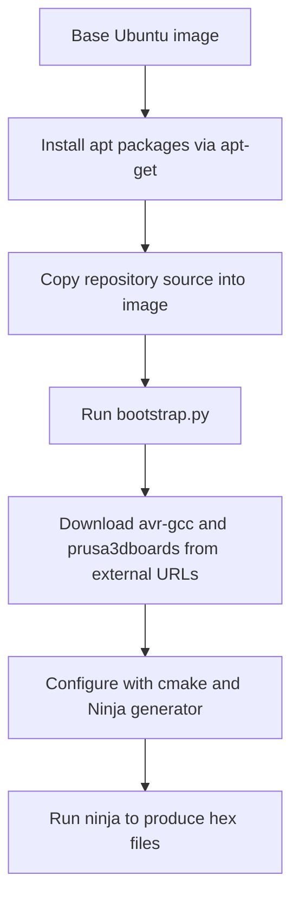

# ADR 001 — Build Requirements and Docker Feasibility

| Status   | Date       | Project Version |
|----------|------------|-----------------|
| Draft    | 2026-08-23 | 0.0.1           |

## Context

The repository's documentation is spread across `README.md`, `tools/README.md`, `Firmware/variants/README.md`, `utils/bootstrap.py`, and `.github/workflows/build.yml`, with no single place stating what is required to build the firmware or whether the build can run in a container. This ADR consolidates that information from those sources and records the finding on Docker feasibility.

No `Dockerfile` currently exists anywhere in the repository (verified via search, excluding vendored code under `lib/`).

## Decision

Document the build requirements as follows, and record that the build is containerizable using the same toolchain the official CI already relies on.

### Toolchain fetched automatically by `./utils/bootstrap.py`

`bootstrap.py` downloads these into `.dependencies/` and does not require manual installation:

- `avr-gcc` 7.3.0 — pinned AVR cross-compiler
- `prusa3dboards` 1.0.6 — Prusa's Arduino board definitions
- `cmake` >= 3.22.5 (installed if missing from the system)
- `ninja` >= 1.12.1 (installed if missing from the system)

### System packages that must already be present on the host

- `git`
- Python >= 3.8, with pip packages `pyelftools`, `polib`, `regex`
- `gettext` (only required when building translations)

Debian and Ubuntu install command:

    sudo apt-get install cmake ninja-build python3-pyelftools python3-polib python3-regex gettext

Fedora and RHEL install command:

    sudo dnf install cmake ninja-build python3-pyelftools python3-polib python3-regex gettext

### Build sequence

    git clone https://github.com/prusa3d/Prusa-Firmware
    cd Prusa-Firmware
    ./utils/bootstrap.py
    mkdir build
    cd build
    cmake .. -G Ninja -DCMAKE_BUILD_TYPE=Release -DCMAKE_TOOLCHAIN_FILE=../cmake/AvrGcc.cmake
    ninja

Output `.hex` files are written to `build/`. `PF-build.sh` wraps this sequence interactively for Debian/Ubuntu users without development experience; `MK404-build.sh` builds against the MK404 simulator. Windows developers use VSCode plus the CMake Tools extension, Python, and Git Bash, driving the same underlying CMake configuration. The Arduino IDE path is documented but explicitly deprecated and unsupported.

### Docker feasibility

The official CI workflow (`.github/workflows/build.yml`) already performs this exact build on a plain `ubuntu-latest` runner using only `apt-get install cmake ninja-build python3-pyelftools python3-regex python3-polib` followed by `./utils/bootstrap.py`. This is a standard, containerizable Linux setup with no dependency on GitHub-runner-specific tooling.

The following diagram shows the container build flow:

A minimal Dockerfile equivalent to the CI steps:

    FROM ubuntu:22.04
    RUN apt-get update && apt-get install -y \
        git cmake ninja-build python3 python3-pip \
        python3-pyelftools python3-polib python3-regex gettext ca-certificates
    WORKDIR /src
    COPY . .
    RUN ./utils/bootstrap.py
    RUN mkdir build && cd build && \
        cmake .. -G Ninja -DCMAKE_BUILD_TYPE=Release -DCMAKE_TOOLCHAIN_FILE=../cmake/AvrGcc.cmake && \
        ninja

One caveat applies: `bootstrap.py` downloads `avr-gcc` and `prusa3dboards` from external URLs (Microchip and Prusa's GitHub raw content) during the build, so the container build requires network access at build time. For an offline or fully reproducible image, pre-populate `.dependencies/` on the host and `COPY` it into the image instead of invoking `bootstrap.py` inside the build.

### Rollout plan

Firmware modifications are planned on the `automated_build` branch, with further modifications expected afterward. Rather than introducing a Docker-based pipeline immediately, the existing GitHub Actions workflow is reused first:

1. `.github/workflows/build.yml` `push.branches` has been extended to include `automated_build` (in addition to `MK3`, `MK3_*`), so pushes to that branch now run the existing `build`, `check-lang`, and `tests` jobs on GitHub-hosted `ubuntu-latest` runners.
2. Pushing the branch and observing a green run on GitHub-hosted runners validates that the current build requirements (documented above) are sufficient and that the modifications compile cleanly, before any container-based tooling is introduced.
3. A Docker-based build (local or as an alternative CI path) remains an optional follow-up, to be revisited only if GitHub-hosted runners prove insufficient (for example, for hermetic/offline builds or local reproduction of CI failures) — see the Docker feasibility findings above, which remain valid whenever that need arises.

## Consequences

- Contributors and CI maintainers have a single reference for build prerequisites without cross-referencing multiple READMEs and workflow files.
- Docker-based builds (local reproducible environments, alternative CI runners, or release packaging) are confirmed feasible using the toolchain already exercised by the official CI, without requiring any repository changes.
- No `Dockerfile` is added to the repository by this ADR; the example above is illustrative only. Adding an official, maintained `Dockerfile` would be a separate follow-up decision.
- The network dependency in `bootstrap.py` means containerized builds are not reproducible offline unless `.dependencies/` is pre-staged, which should be considered if hermetic builds become a requirement.
- Validating the `automated_build` branch on GitHub-hosted runners first means firmware modifications get build feedback without any new CI infrastructure to maintain; Docker-based CI/CD stays a documented option rather than immediate work.
